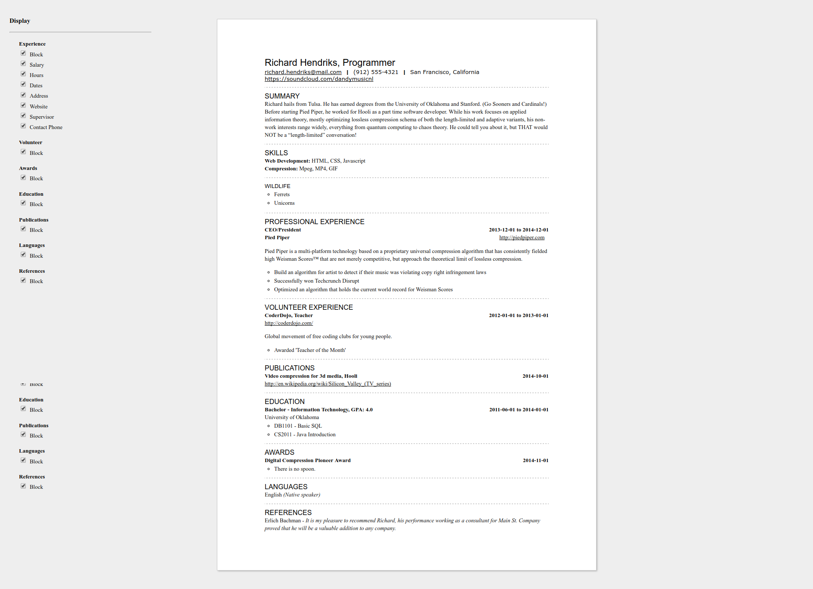

# jsonresume-theme-Kate
A compact theme for JSON Resume, designed for printing.

Tries to fit as much information as possible onto a single page without making sections look cluttered.

## Table of Contents

* [Preview](#preview)
* [Origional Work](#origional-work)
* [Example](#example)
* [Running](#running)
* [Options](#options)
* [License](#license)

## Preview


## Origional Work
This JSON resume theme is a modification of [Ainsley Chong's onepage](https://github.com/ainsleyc/jsonresume-theme-onepage) theme.

## Example
http://themes.jsonresume.org/theme/kate

## Running

```sh
sudo npm install -g resume-cli
git clone https://github.com/kneeki/jsonresume-theme-Kate.git
cd jsonresume-theme-kate
resume serve
```
You can print directly from the served html.

## Options

For the "experience" and "skills" sections, you can optionally replace the "highlights" list with a "details" list with this format.

```js
"details": [
  { "text": "Javascript", "comment": "expert" },
  { "text": "Coffeescript", "comment": "expert" },
  { "text": "Ruby", "comment": "competent" },
  { "text": "Java", "comment": "novice" }
]
```

You may toggle `SORT_INTERESTS_KEYWORDS` to alphabetically sort the keywords (useful for long arrays). See `index.js`. The interest section is no longer denoted with a `.sectionName`. Instead, each `interest[i].name` has the `.sectionName` class.

## License
The MIT License (MIT)

Copyright (c) 2015 Ainsley Chong

Permission is hereby granted, free of charge, to any person obtaining a copy
of this software and associated documentation files (the "Software"), to deal
in the Software without restriction, including without limitation the rights
to use, copy, modify, merge, publish, distribute, sublicense, and/or sell
copies of the Software, and to permit persons to whom the Software is
furnished to do so, subject to the following conditions:

The above copyright notice and this permission notice shall be included in all
copies or substantial portions of the Software.

THE SOFTWARE IS PROVIDED "AS IS", WITHOUT WARRANTY OF ANY KIND, EXPRESS OR
IMPLIED, INCLUDING BUT NOT LIMITED TO THE WARRANTIES OF MERCHANTABILITY,
FITNESS FOR A PARTICULAR PURPOSE AND NONINFRINGEMENT. IN NO EVENT SHALL THE
AUTHORS OR COPYRIGHT HOLDERS BE LIABLE FOR ANY CLAIM, DAMAGES OR OTHER
LIABILITY, WHETHER IN AN ACTION OF CONTRACT, TORT OR OTHERWISE, ARISING FROM,
OUT OF OR IN CONNECTION WITH THE SOFTWARE OR THE USE OR OTHER DEALINGS IN THE
SOFTWARE.
